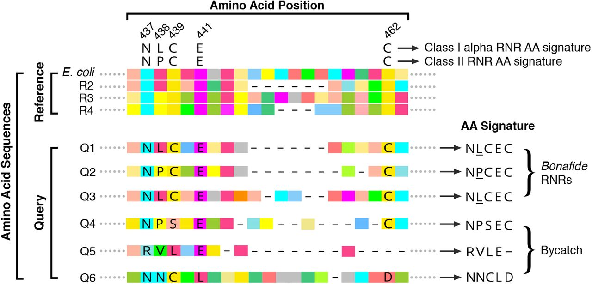
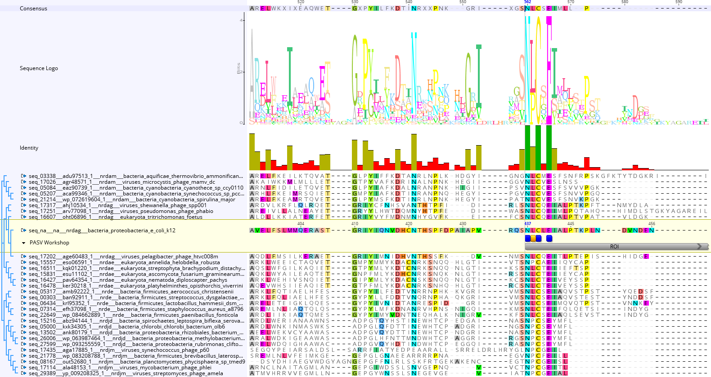
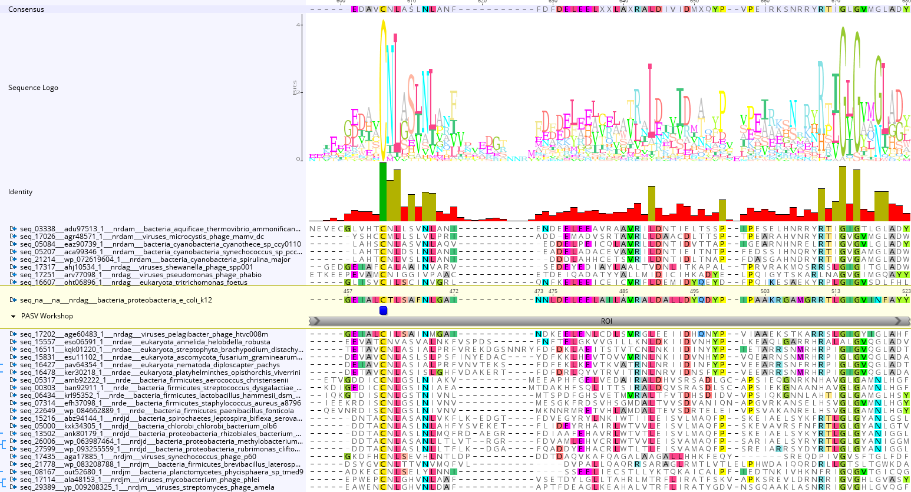
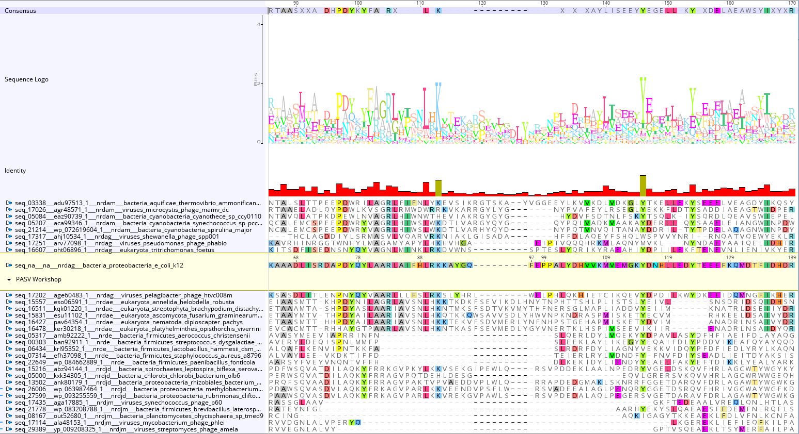
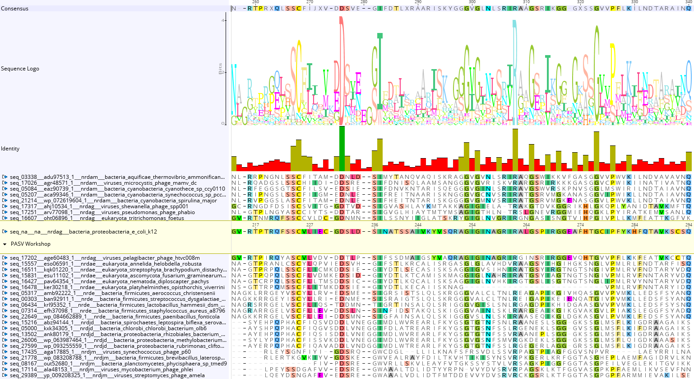
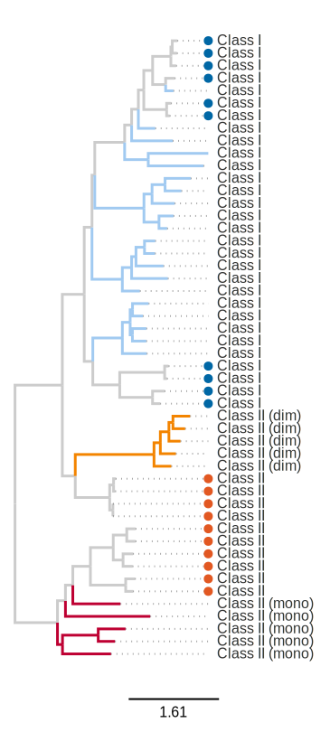
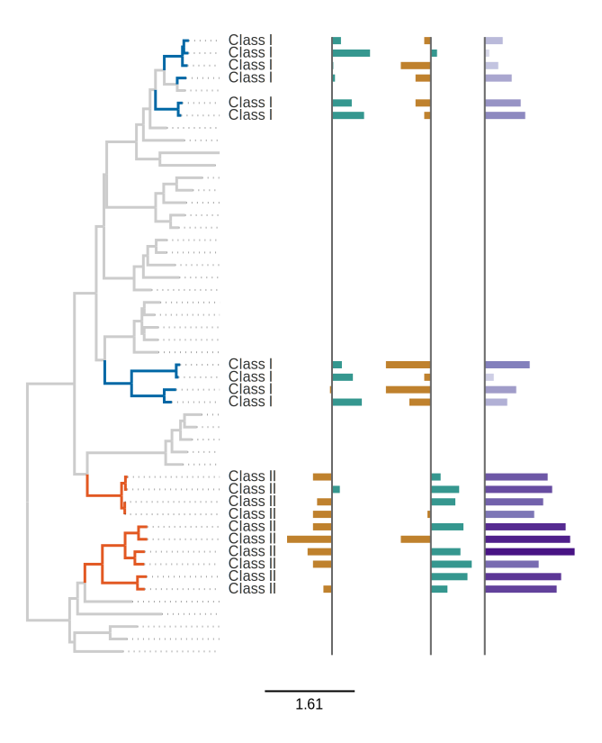

# Before starting...

Kitty names

* Lord Squiggly
* Darth Squiggles
* Squiggle Monster

Run the Docker image for the workshop container like so:

```
~/p/pasv_iroki_workshop$ pwd
/home/ryan/projects/pasv_iroki_workshop
~/p/pasv_iroki_workshop$ sudo docker/run_r_server.sh pasv_docker_workshop 3 $(pwd) ryan
```

Don't forget to change the RStudio font to Fira Code! (Tools -> Global Options -> Appearance)

Make sure the `work` dir is empty.

Clear all chunk output.

# Set up the Notebook

## Environment

First, we can set some environment variables that will help us out.

```{bash, engine.opts = '-l'}
cp $HOME/projects/pasv_iroki_workshop/assets/_bash_profile $HOME/.bash_profile
```

This makes sure that the `$WORK_DIR` is created.

```{bash, engine.opts='-l'}
mkdir -p $WORK_DIR
```

Don't forget to run `source ~/.bash_profile` at the terminal!

## R packages

We will also need a couple of R packages.

```{r}
library(ape)
library(phytools)
```

# Super tiny command line crash course!

If you have never heard of the terminal or a the command line before, I suggest you check out this [blog post](https://www.tenderisthebyte.com/blog/2019/12/15/beginning-bioinformatics-command-line-terminal/) I wrote aimed at true beginners.  I will give a very brief summary here.

## What is the command line?

Most of the programs you're exposed to on a daily basis have what are called [graphical user interfaces](https://en.wikipedia.org/wiki/Graphical_user_interface) (GUIs).  You interact with them by clicking the mouse, tapping, and scrolling.

Many bioinformatics programs that you will use don't have a GUI.  Rather, they have [command line interfaces](https://en.wikipedia.org/wiki/Command-line_interface) (CLIs).   Rather than pointing and clicking, you interact with these programs by typing things at the command line, generally through a [terminal](https://askubuntu.com/questions/38162/what-is-a-terminal-and-how-do-i-open-and-use-it).

## Running a command line app

If you're doing a lot of bioinformatics, you are almost certainly going to have to get comfortable running programs on the command line.  Don't worry though, after a bit of practice, you'll get the hang of it!

Here is an example command.

```
find . -name '*.txt'
```

A couple of things to note:

* `find` is the name of the command/program.  If you guessed that you can use it to "find" files or directories, then you're right!
* The `.` character is an argument passed in to the `find` command.  Arguments allow users to "modify" the behavior of the program.  In this case, the `.` tells `find` look in the current directory
* `-name` is a flag.  It says, the next thing you type will be interpreted as the argument for the `name` option.
* `'*.txt'` is the argument for the `name` option.  It tells `find` that you want to look for files with the extension `*.txt`.

One more thing...if you're reading documentation, you will often see a `$` in front of a command like this:

```
$ find . -name '*.txt'
```

The `$` isn't part of the command; it represents the command "prompt".  It's just a convenience for the reader so you know that what comes next is a command that you should enter in your terminal.

# Install basic packages

Let's kick things off, let's use the `apt-get` command to install some basic packages that we are going to need.

## apt-get

`apt-get` is a program used to manage packages:  installing, upgrading, removal, etc.  We will use a couple of subcommands:

* `update` -- retrieves new lists of packages
* `upgrade` -- performs upgrades
* `install` -- snstall new packages

Some command line programs are pretty complicated, so their functionality is broken up into "subcommands".  In this case, `apt-get` is the main command, and `update`, `upgrade`, etc. are subcommands.  You can still pass arguments to subcommands the same as you would normal commands.

## Required packages

If you started with a fresh Ubuntu distribution, you would need to install some basic packages to get going.  If you've ran some bioinfomatics programs before, there is a good chance that you will already have these installed!

* [cmake](https://cmake.org/) -- needed for installing MMseqs2 from source
* [curl](https://curl.se/) -- used to download a bunch of source code and binaries
* [git](https://git-scm.com/) -- widely used version control software.  Used to install `grep_ids`.
* [make](https://www.gnu.org/software/make/) -- used to install MAFFT (we won't look at MAFFT today though!)
* [ruby-full](https://www.ruby-lang.org/en/documentation/installation/#apt) -- maybe the simplest way to get started with [Ruby](https://www.ruby-lang.org/) if you aren't a Ruby programmer

## sudo

`sudo` is used to execute commands as another user.  You will often use it to execute commands that need elivated privledges (or super-user priledges).  The `apt-get` command requires that you have "sudo" privledges to install new packages.

## Let's install some packages already, jeez!

This will take about a minute.  After running, there will be a bunch of output, but we will just delete it after looking at it for a bit, since we don't really care about it.

(takes ~20s)


```{bash, engine.opts = '-l'}
sudo apt-get update
sudo apt-get upgrade -y
sudo apt-get install -y \
  cmake \
  curl \
  git \
  make \
  ruby-full
```

Did you see the `-y` in there?  That is an argument to the command.

You will also need some bioinformatics software: Clustal Omega, MMseqs2, and of course, PASV!

# Install bioinformatics software

Now let's get crazy and install some bioinformatics software.

## grep_ids

This is a simple (and fast!) program that I like to use to pull sequences from sequence files given their IDs.  Since there are no binaries available (sorry folks!), and the code is available on GitHub, we will install it from source.

One thing to note is the `$HOME` bit.  It is a way to specify environment variables in the shell.  In this case, the variable is called `HOME`.

You can see all the environment variables in available in your current session by running the `env` command.

```{bash, engine.opts = '-l'}
# Create a directory to put the source code in.
mkdir -p $HOME/opt

# "Move" in to that directory.
cd $HOME/opt

# Get the source code from GitHub on to our local machine.
git clone https://github.com/mooreryan/grep_seqs.git

# The `git` command will make a folder called `grep_seqs` with the source code
# in it.  Move in to that directory to install.
cd grep_seqs

# `gcc` is the GNU project C and C++ compiler.  It "compiles" C and C++ source
# code into executable programs.
gcc grep_ids.c vendor/*.c -I./vendor -lz -Wall -g -O3 -o grep_ids

# See below for explanation.
sudo ln -sf $HOME/opt/grep_seqs/grep_ids /usr/local/bin/grep_ids
```

Let's talk a bit more about that last command.  We need go over the `PATH` variable.  If you want to run a command, you generally type the name of the command at the prompt like this:

```{bash, engine.opts = '-l'}
echo 'hello, world!'
```

And it will "just work".  The shell knows where to find the `echo` program.  But where is it actually?  And how does the shell know how to find it?

To answer the first question, we can use the `which` command, which is used to locate commands.  It searches the `PATH` for "executable" files matching the names of the arguments (yes, you can pass multiple things to `which`).  Executable files are those that you can run!

```{bash, engine.opts = '-l'}
which echo cat
```

So the `echo` and `cat` commands live in `/usr/bin` (i.e., in the `bin` directory inside the `usr` directory inside the root directory `/`).

Now, what's the `PATH` thing all about?  You can find a pretty long explanation [here](http://www.linfo.org/path_env_var.html), but let's TL;DR that.

> PATH is an environmental variable in Linux and other Unix-like operating systems that tells the shell which directories to search for executable files (i.e., ready-to-run programs) in response to commands issued by a user.

If you type a command at the command line that isn't built in to the shell and doesn't include an absolute/relative path, the shell will search in the directories specified in the `PATH` environment variable until it finds an executable file with that name.

You should note that once it finds a matching executable it will stop looking.  That means that higher preference is given to directories at the front of the `PATH` variable than those at the back.  Because of this, users will often put their custom stuff at the beginning of the `PATH` so their own executables are found before the system ones.

Let's check what out `PATH` variable is...

```{bash, engine.opts = '-l'}
echo $PATH
```

It has a `:` separated list of directories.  These are the ones that the shell looks for executable files in.  Let's see if the `grep_ids` is available.  Remember which command we use?

```{bash}
which grep_ids
```

Yep, it's there in `/usr/local/bin`.  (It's a common directory where you will find user installed software.)

That's because `ln` is a command that creates links between files.  In this case, I created a symbolic link from the executable file `grep_ids` to the location specified (`/usr/local/bin/grep_ids`).

Links can be a little wonky at first.  To learn more see [this StackOverflow question](https://stackoverflow.com/a/185903), and this cool [Linux Gazette article](https://linuxgazette.net/105/pitcher.html).

```{bash}
ls -lah $(which grep_ids)
ls -lah /home/ryan/opt/grep_seqs/grep_ids
```

If you noticed `/usr/local/bin` in the `PATH` variable, good catch!  I linked the `grep_ids` program there because it was on my `PATH`.  Alternatively, I could have added the `/home/ryan/opt/grep_seqs` folder to the `PATH` variable to get more or less the same effect:  being able to type `grep_ids` without specifying the full path.

Let's check that it actually works.

```{bash}
grep_ids
```

Yep!  That output is the help message for the program.

## Clustal Omega

[Clustal Omega](http://www.clustal.org/omega/) is a multiple sequence aligner (MSA).  PASV works with pretty much any MSA software, but we will be using Clustal Omega, since it worked the best with RNR [in our tests](https://doi.org/10.1101/2021.01.20.427478).

(~10 seconds)

```{bash, engine.opts = '-l'}
mkdir -p $HOME/opt/clustalo/bin

# Download the clustalo binary file using `curl`.  The `>` is for
# redirection.
\curl -L http://www.clustal.org/omega/clustalo-1.2.4-Ubuntu-x86_64 > \
  $HOME/opt/clustalo/bin/clustalo

# Make the `clustalo` binary executable with the `chmod` command.
chmod 755 $HOME/opt/clustalo/bin/clustalo

# Here's the link command again.
sudo ln -sf $HOME/opt/clustalo/bin/clustalo /usr/local/bin/clustalo
```

Some notes:

* See [here](https://thoughtbot.com/blog/input-output-redirection-in-the-shell#redirecting-output) for an article explaining input and output redirection.
* `chmod 755` makes the file readable, writable, and executable by the current user (7) and readable and executable by the group and the worls (55).  (Permissions in unix-y OSes is a pretty interesting topic.)

Check that it worked.

```{bash}
which clustalo && clustalo --version && echo 'It worked!'
```

## PASV

This time we use `curl` to download a specific release of the PASV code.  I'm also using the `|` to pipe the output of `curl` directly into the `tar` command, since the file we're downloading is an archive file that needs to be unpacked.  Finally, I use the `ln` linking trick from before.

(~10 seconds)

```{bash, engine.opts = '-l'}
\curl -L https://github.com/mooreryan/pasv/archive/refs/tags/v1.3.0.tar.gz \
  | tar xz -C $HOME/opt

sudo ln -sf $HOME/opt/pasv-1.3.0/pasv /usr/local/bin/pasv
```

Next, we need to install the dependencies `pasv` needs to run.  `pasv` is a Ruby program so it is (admittedly) a little tough to install.

(~10s)

```{bash, engine.opts = '-l'}
# Move into the directory where the pasv source code is located.
cd $HOME/opt/pasv-1.3.0/

# Use the `gem` command to install `bundler`, the program we use to manage Ruby
# program dependencies.
gem install bundler:1.17.3

# Now use `bundle` to install the dependencies that are specified in the
# `Gemfile` that came with the `pasv` source code.
bundle install
```

Finally, we run the tests with `make` to make sure everything worked okay!

(~5s)

```{bash, engine.opts = '-l'}
cd $HOME/opt/pasv-1.3.0/
make test_clustalo && echo 'All good!'
```

## Install MMseqs2

This is from the install instructions on the [MMseqs2 github page](https://github.com/soedinglab/MMseqs2#installation).  My computer has the [AVX2 instructions](https://www.tenderisthebyte.com/blog/2019/05/21/mmseqs-wrapper/), so we will use that binary as it is faster.

(~20s)

```{bash, engine.opts = '-l'}
# Make the directory.
mkdir -p $HOME/opt

# Move into the directory.
cd $HOME/opt

# Download the mmseqs archive file.
wget --quiet https://mmseqs.com/latest/mmseqs-linux-avx2.tar.gz

# Extract it!
tar xvfz mmseqs-linux-avx2.tar.gz
```

This time we didn't use the `ln` trick.  Let's see if we can still run mmseqs...

```{bash, engine.opts = '-l'}
which mmseqs && echo "It's here!"
```

Huh, why did that work?  If you guessed that it has something to do with the `PATH` variable, you're right again!

Let's remind ourselves what's in the `PATH` variable.

```{bash, engine.opts = '-l'}
echo $PATH
```

The first thing in the `PATH` is `/home/ryan/opt/mmseqs/bin`, which means the shell knows how to find the `mmseqs` command.

But how did it get there?  Well, I told it to be there in the `$HOME/.bash_profile` file.  Check it out.

```{bash, engine.opts = '-l'}
grep opt/mmseqs $HOME/.bash_profile
```

The `grep` command is used to print lines in files that match patterns.  In this case, I wanted to print out any line in the `.bash_profile` that contained the pattern `opt/mmseqs`.  The `export PATH` line says, take whatever was in `PATH` and prepend `$HOME/opt/mmseqs/bin:` onto it and make it available to use.

That's how come we could use the `mmseqs` command without using `ln` or moving `mmseqs` binary file somewhere else.  Of course, we could have put the directories conatining `grep_ids`, `pasv`, and `clustalo` on the `PATH` as well.  I didn't because I wanted to spice up the presentation a bit :)$HOME/opt/mmseqs/bin:

# Now, let's get crazy!

You've finished the prelude and totally crushed it...great job!  Now let's get down to some serious bioinformatics business!!  Well, not *too* serious I hope ^-^

## What we're gonna do

So here's what we're going to do.  I've set up some "fake" data for us to play with.  I've constructed a fake "virome" data set.  In fact it doesn't even have exclusively viral peptides in it (shhh!).  Our "virome" is made up of a set of non-RNR sequences taken from [SwissProt](https://www.uniprot.org/uniprot/?query=reviewed:yes), with some putative RNRs (bonafide and rejected) taken from the [PASV manuscript](https://doi.org/10.1101/2021.01.20.427478).

## A little RNR background

If you want to know more about RNRs, you can check out the [Harrison et al., 2019](https://doi.org/10.3389/fmicb.2019.00134) paper from our lab.  While there is a lot of cool stuff in there, you will find [a nice cartoon](https://www.frontiersin.org/files/Articles/435418/fmicb-10-00134-HTML/image_m/fmicb-10-00134-g001.jpg) showing the relationship between classes, subclasses, clades and environmental requirements.

### General

RNR -> ribonucleotide reductase

* Reduce ribonucleotides to deoxyribonucleotides
* Only way to make deoxynucleoside triphosphate (dNTPs) from scratch
* Also the rate-limiting step in DNA synthesis
* Present in virtually all cellular life and many viruses
* Many types with different biochemical requirements, though all RNRs share a common ancestor
* Some conserved residues are still shared among types

### Residues

For reference here is a basic overview of the residues that we are going to use as key residues in PASV.  Check the [Harrison et al., 2019](https://doi.org/10.3389/fmicb.2019.00134) paper if you want to know more.  It has good citations for all of this stuff!

* N437 - Binds substrate in the active site
* X438 - Unknown
* C439 - Active site cysteine. Initiates ribonucleotide reduction by removing the 3'-H from the NTP
* E441 - Binds substrate in the active site
* C462 - Active site cysteine. Forms a disulfide bridge with C225 (outside ROI)
* P621 - Binds substrate in the active site


### The "virome" seqs

This set of sequences was "carefully" constructed by me to give y'all a lovely tutorial experience.  While I've simplified things a lot, hopefully you will see how you could apply some of these same techniques to your own data.

Here is an overview of what's in there.

```{bash, engine.opts='-l'}
# Print the number of sequences in the file.
printf "num seqs: %d\n\n" $(grep -c '^>' $VIROME_SEQS)

# Show the number of "types" of sequences in the virome.
grep '^>' $VIROME_SEQS | sed -E 's/^>(.*)___.*/\1/' | sort | uniq -c
```

Since we've been learning all about the command line, let's go over some of the new stuff here.

#### First command

* `printf` is a cool function for formatted output.  The first argument is a format string.  The `%d` part says put the result of the next argument here.  The `d` is the format specifier for numbers.
* The `$(...)` is command substitution.  It says, run this thing in the parenthesis and replace the expression with the output.
* `grep -c '^>' $VIROME_SEQS` -- the `grep` command again.
  * This time `-c` says count the number of occurences of the pattern `^>`.
  * That pattern is a [regular expression](https://www.regular-expressions.info/) that matches `>` characters at the beginning of lines.
  * The `>` character is the description line marker in a [FASTA file](https://en.wikipedia.org/wiki/FASTA_format#Description_line).  So counting them effectively counts the number of sequences in a FASTA file.  Note if you try this on a compressed fasta file, it won't work.

#### Second command

* We saw the `|` pipe before and here again we use it to pass output from one command to another.
* `sed` is a stream editor for filtering and transforming text.  It's pretty flexible.  Here I'm using it to pull out certain parts of the sequence headers and pass them in to the `sort` command.
* `uniq -c` says take the count of unique things in the stream.
* The whole second command gives the count of the "types" of things in the virome file.
  * The headers all look something like this: `>type_id___sequence_id`.
  * So you can use `sed` to get the `type_id` for all headers and then count unique instances by piping it to `sort | uniq -c`.

### Main goal

Our goal is to pull out the RNR sequences from our virome, validate them with PASV, put them on a tree with some reference sequences, and finally, customize that tree with [Iroki](https://www.iroki.net/).

Alright?  Let's roll!!

# Search the virome for RNR sequences

First, we will use [MMseqs2](https://github.com/soedinglab/MMseqs2) to search our virome peptides against a set of sequences from the (unfortunately currently defunct) [RNRdb](https://doi.org/10.1186/1471-2164-10-589).

You will see that rather than providing actual file names, I've used more environment variables (like `$VIROME_SEQS`).  This makes it easier to keep track of everything for the tutorial.  Sometimes I will do it in for real as well, especially if I'm using a job scheduler like [Slurm](https://slurm.schedmd.com/documentation.html).

`mmseqs` is the main command and `easy-search` is the subcommand.  Everything that follows are arugments to the `easy-search` program.

We use the default options for everything except for `--threads 4`, which tells `mmseqs` to only use 4 threads rather than all available.

(~10s)

```{bash, engine.opts='-l'}
time mmseqs easy-search $VIROME_SEQS $RNRDB_SEQS $SEARCH_OUT $MMSEQS_TMPDIR \
     --threads 4
rm -r $MMSEQS_TMPDIR
```

By default, `mmseqs` spits out a file that looks pretty much like the BLAST TSV output..  Let's take a look and make sure we got the sequences that we wanted.  We will use a similar command as we did above.

```{bash, engine.opts='-l'}
cut -f1 $SEARCH_OUT | sort | uniq | sed -E 's/^(.*)___.*/\1/' | sort | uniq -c
```

Oh look, we even pulled in some SwissProt proteins that aren't supposed to be RNRs!

## Get the putative RNR sequences

Now we can pull out the "RNRs" from the virome sequences.  To do this, we will use the `grep_ids` program we installed earlier.


```{bash, engine.opts='-l'}
grep_ids <(cut -f1 $SEARCH_OUT) $VIROME_SEQS > $PUTATIVE_RNRS
grep -c '^>' $PUTATIVE_RNRS
```
Remeber that `grep_ids` takes a file of IDs as the first argument.  (In this case, the FASTA ID is everything on the header line up until the first space.)  Since it takes a file, we can use the `<()` trick pass the result of the subprocess `(...)` via file descriptors so the command treats the result of `cut` as though it were a file (mostly).

`grep_ids` outputs matching sequences, so we redirect that output into a new file specified by the `PUTATIVE_RNRS` variable.

# Run pasv

Now that we have the our FASTA file of putative RNR sequences, we are ready to validate them with PASV.

First get the reference sequences for RNR Class I alpha subunits and Class II.

```{bash, engine.opts='-l'}
\curl -L https://raw.githubusercontent.com/mooreryan/pasv/5475454347172f4e897ada6508b8069962c32f4f/assets/ref_sets/rnr/rnr__classIa_classII__best_practices.fa > $PASV_REFS
```

This is the reference set from the PASV paper.  Actually, this is as good a time as any to talk about PASV reference sequences and PASV key residues.

## A little background

The whole point of PASV is to automate the steps that a domain expert like Amelia would do with her RNR sequences (or whatever your favorite protein is!).  It gives you a way to automatically validate that your environmental sequences have certain conserved residues or active sites, and check whether they span certain regions of interest.  It's pretty simple in that it works by running alignments for each query against a chosen reference set, and then validating user-provided key residues and regions.



The cool thing is that many proteins have a lot of biochemical characterization, and with PASV, we can leverage in knowledge a (semi-)automated way.

There are two main aspects that go into getting started with using PASV for a new protein.  You need to choose good reference sequences for the alignment, and you need to choose good, meaningful residues to validate.

## Reference sequences

When it comes to choosing reference sequences, you can be a little more cavalier.  At least when it comes to RNRs, as long as you take 10 or so full length sequences and use Clustal Omega, then you should be alright.  We tested a lot of different variables and multiple aligners, but those were the most important takeaways.

## Key residues

In the case of the RNRs, we validate residues that when mutated are known to cause mutations that destroy the functionality of the proteins.  This is nice because it gives us a decent idea about something that may look a lot like an RNR, but it is missing some key aspect of its functionality.  Also, the fact that the key residues are highly conserved means that sequences that do not have the correct signature are often bycatch from the homology search.

Let's check out a couple of alignments to see how these "key residues" look.

### Looking at key residues

For this, we chose 30 sequences from across a good chunk of known RNR diversity.  If we were trying to choose residues "for real" after going through these, we would keep adding more and more sequences to see if the trends we see in the smaller alignments hold up.

One thing that would be especially important to include is more environmental sequences.  You will often see novel diversity in the environment when compared to the stuff in the databases.

#### Region of interest (ROI) start

* Start of the region of interest
  * It contains many important active sites
  * It's conserved among Class I and Class II
  * It's flanked (at least on one side) by region(s) that don't exist in both classes
  * We've used it historically in the lab -- i.e., lots of prior art
* Lot's of important residues here
* Also the interesting 438 position



#### Another active site

This active site is a little further down, but I wanted to show it to you.



#### Unconserved region

Many of you have probably spent a ton of time starting at alignments, but I wanted to show a region with less conservation.

Can you see how none of these residues would be a good candidates for PASV key residues?



#### Conserved but unused

There are a good number of residues in RNR (and other proteins) that are highly conserved, but don't have much (if any) biochemical characterization.  With RNR we are lucky in that there are many residues that are critical to proper function that also have extensive biochemical characterization.  If that *weren't* the case, i.e., we were working with a protein with less biochemical characterization, then we could potentially use some of these sites.



## Back to running pasv

Okay, so let's run PASV now!  Note that we can prepend any command with the `time` command to see how long it took to run!

(While this is running, pop open the files pasv_outdir.  Takes about a minute to run.)

```{bash, engine.opts='-l'}
# Remove the pasv outdir if it exists.
[ -d $PASV_OUTDIR ] && rm -r $PASV_OUTDIR

time pasv --refs $PASV_REFS \
          --queries $PUTATIVE_RNRS \
          --threads 4 \
          --outdir $PASV_OUTDIR \
          --min-count 1 \
          --start 437 \
          --end 625 \
          437 438 439 441 462 621
```

## PASV output files

Let's check out the output files.

### pasv_types.txt

You get "partition" files, which are just a convenience if you want to select sequences with certain signatures.  Generally I use the `pasv_types.txt` file and pull out what I need.  Here is what it looks like.

```{r}
is_good <- function(s) {
  grepl("^N[LP]CECP_", s)
}

library(tidyverse)
pasv_types <- read_tsv("work/pasv_outdir/pasv_types.txt") %>%
  # mutate(result = c(rep("good", times = 20), rep("bad", times = 25))) %>%
  mutate(result = is_good(type)) %>%
  select(-similarity_score, -geometric_index)
View(pasv_types)
```

As you can see, the sequences we expect to be good RNRs have the correct signature and those that we expect to be bad have the incorrect signature.  Nice!

### pasv_counts.txt

The other thing is `pasv_counts.txt`.  It simply counts the number of sequences in with each signature.  It looks like this.

```{r}
pasv_counts <- read_tsv("work/pasv_outdir/pasv_counts.txt")
View(pasv_counts)
```

It just gives you the counts for each type.

# Making a tree from the "bonafide" RNR sequences

## Import into Geneious

For this, I'm going to import the `N[LP]CECP_Yes` sequences into [Geneious](https://www.geneious.com/) and align them with the 30 RNR sequences we looked at when talking about RNR conserved residues.

Often, you will want to grab a lot more reference sequences.  It kind of depends on the protein you're aligning, how diverse the sequences are, what you're trying to show, etc.  But often you need a good number of references to scaffold the tree or to provide adequate context.

## Run alignment with MAFFT

I used MAFFT for the aligment.

## Make tree with FastTree

After running the alignment, I used Geneious to build a tree with FastTree.

## Export files

Make a folder `work/geneious_out`. Then export these:

* Alignment to get the names
* Newick file for rerooting

## Reroot the tree

Next, we reroot the tree so that the Class II monomeric sequences are off by themselves and the Class I sequences are branching off from the Class II dimeric sequences.  This is the current hypothesis regarding RNR evolution, so we may as well put the root in a decent place!


### Reroot code

Here is the rerooting code!

```{r}
# Ryan: you may need to change this name in the live demo!
tre <- read.tree(file = "work/geneious_out/pasv bonafide RNRs with refs FastTree Tree.newick")
```

This part we need to run a bit differently since I need to actually click in the correct spot.  Wish me luck doing this live!!

Don't forget this ... :)

```
# Do this part interactively.
plot(tre)
rooted <- reroot(tre, interactive = TRUE)
```

```{r}
# Also make sure this name is correct!
write.tree(rooted, file = "work/geneious_out/pasv bonafide RNRs with refs FastTree Tree.rooted.newick")
```

## Iroki mapping files

The last thing we will do is to make some mapping files and visualize the tree using [Iroki](https://www.iroki.net/).

## Resulting trees

In case the live demo crashes and burns, here are what the trees should look like.





# Wrap up

That was a lot of stuff we covered!

* Command line crash course
* Installing packages and bioinformatics software
* Pulling a protein of interest (RNR) from an environmental sequence dataset
* Validating putative RNRs
* Running aligments and building trees in Geneious
* Rerooting trees
* Making mapping files and visualizing trees with Iroki

This was just a little piece of what we do in our lab when using protein coding marker genes to study environmental microbial populations.  There is a ton more we could talk about, but hopefully this gives you a little taste of what's going on.

Thanks!!

# Misc.

## Iroki UI settings

* bar padding 75
* bar axis color 666666
* tree size 15 x 30

## Make some fake abundances

For the mapping file examples, we need some example fake counts and CLR values.

```{r}
higher <- function() {
  n <- 10
  counts <- rnbinom(n = 10, mu = 25, size = 1.75)
  counts[counts == 0] <- 1
  counts
}

lower <- function() {
  n <- 10
  counts <- rnbinom(n = 10, mu = 5, size = 1.75)
  counts[counts == 0] <- 1
  counts
}

set.seed(384307432)
count_data <- tibble(
  which = c(rep("Class I", times = 10),
            rep("Class II", times = 10)),
  sample_1 = c(higher(), lower()),
  sample_1_clr = log(sample_1) - mean(log(sample_1)),
  sample_2 = c(lower(), higher()),
  sample_2_clr = log(sample_2) - mean(log(sample_2)),
)
View(count_data)
write_tsv(x = count_data, file = "work/count_data.tsv")
```
